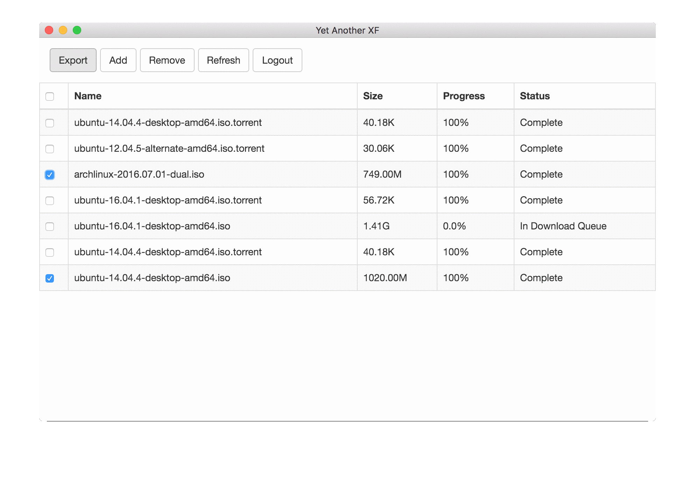

# Yet Another XF

A desktop app for QQDownload (QQ旋风) that can export download links to aria2.

## Why

- The official desktop app is only available on Window.
- The QQDownload web version is outdated and has a terrible UI.

## Getting Started

### Prerequisitie

- Node.js to build and run it
- aria2 for downloading

### Installing
1. Clone it and go to the project's folder:
```sh
$ git clone git@github.com:markx/yaxf.git
$ cd yaxf
```

2. Install dependencies:
```sh
$ npm install
```

3. Build:
```sh
$ npm Build
```

### Run
```sh
$ npm start
```

## ScreenShot


## License
See the [LICENSE](LICENSE.txt) file for license rights and limitations (MIT).
